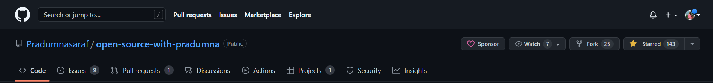
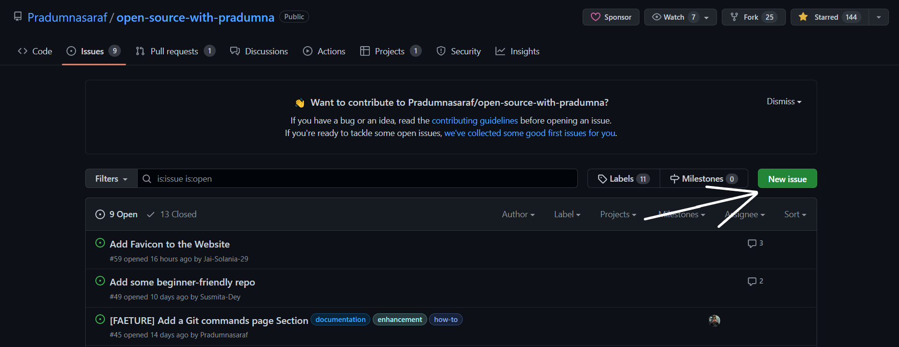
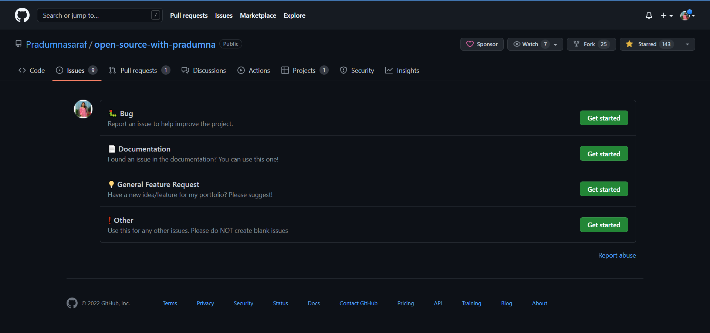
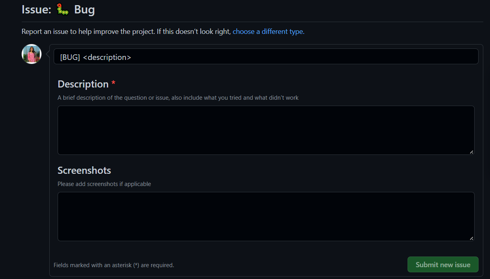
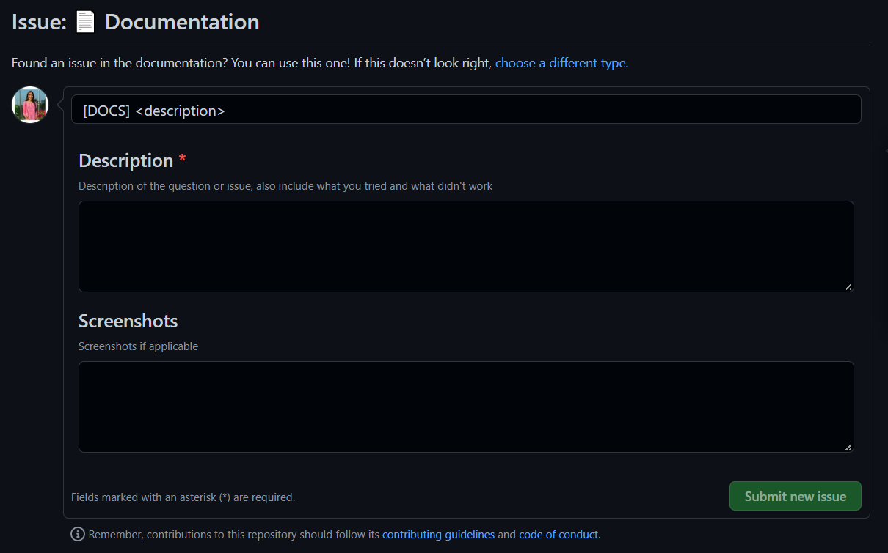
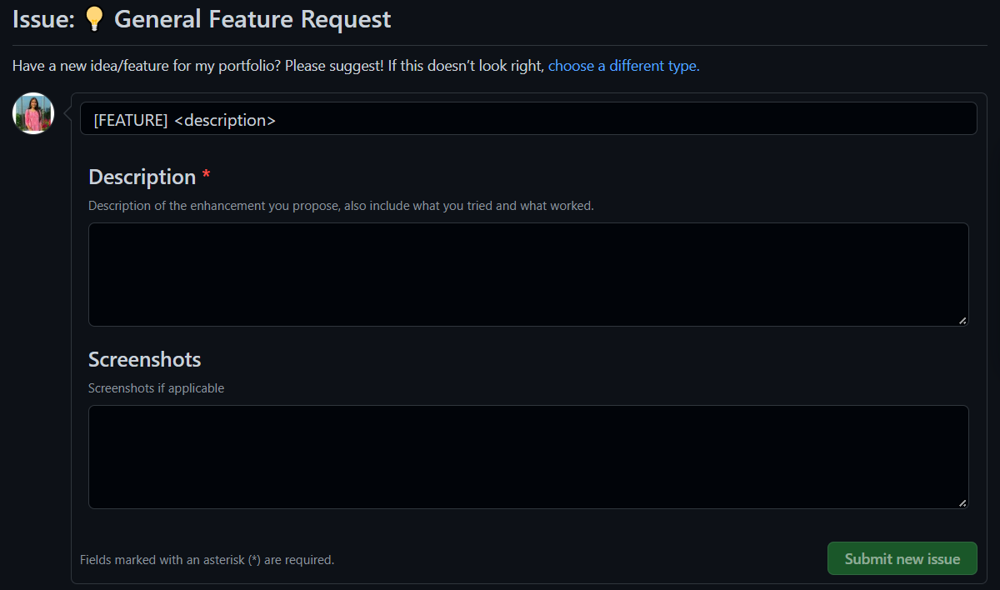
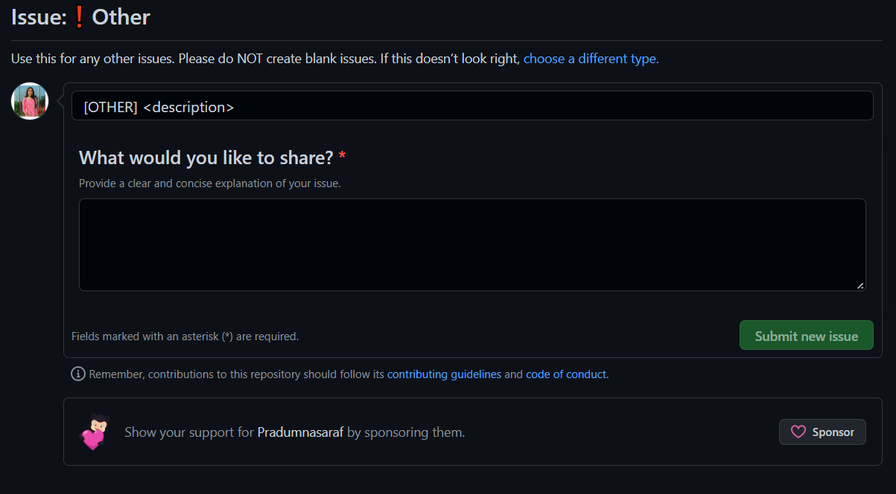

# How to create an issue?

-> Issues can be created in a variety of ways.

-> Issues can be used to keep track of bugs, enhancements, or other requests.

 

## Creating an issue in open-source-with-pradumna.
 

-> On GitHub.com, navigate to the main page of the repository.

 

 

-> Under your repository name, click on `New Issue`

 

 

-> When you click on `New Issue` , you will get a list of 4 types of issues.

 

 

## Let's check all of them one by one

 

### 🐛 Bug

 

-> If you find any bug in the repository feel free to click on `Get Started` and you will get a template in which you will get a template in which you will write a crisp title of the bug and then in the description, ellaborate the bug.

 

-> Try to add some screenshots of the bug so that it will be easy for the maintainer to understand and then react.

 

 

### 📄 Documentation

 

-> If you encounter any error in the documentation then go ahead with this issue and you will be redirected to a similar window.

 

 

### 💡 General Feature Request

 

-> Adding new features is the building block of an open-source project.

 

-> Do you have a new feature to add! Then go ahead and click on the documentation type of issue.

 

 

### ❗ Other

 

-> If you are not sure of the type of your issue, then click on this one and draft the issue.

 

 

And you have successfully created your respective issue 🥳 🥳!!!!